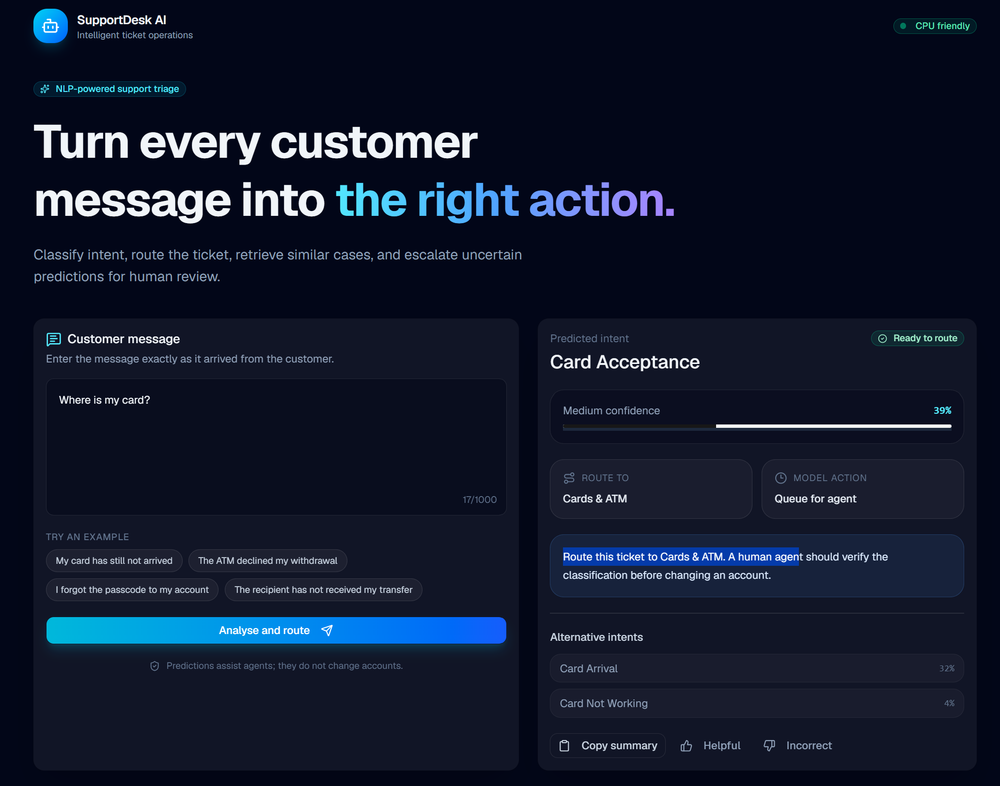

# SupportDesk AI

A CPU-friendly, full-stack NLP application that classifies customer-support messages, routes tickets to the appropriate support team, retrieves similar historical questions, and escalates uncertain predictions for human review.

SupportDesk AI combines a **Flask REST API**, a **TF-IDF + Logistic Regression machine-learning pipeline**, and a responsive **React, TypeScript, and shadcn/ui** interface.

> This project assists support agents. It does not execute banking operations, modify customer accounts, or replace human judgement.

---

## Preview

<!--
Create the following directory and add your screenshot:

docs/images/supportdesk-dashboard.png
-->



---

## What problem does it solve?

Support teams receive thousands of messages such as:

```text
“My card has still not arrived.”

“The ATM declined my withdrawal.”

“I forgot my account passcode.”

“The recipient has not received my transfer.”
```

Manually reading and routing every ticket can increase response time and create inconsistent categorisation.

SupportDesk AI analyses a message and returns:

- the predicted support intent;
- a model confidence score;
- the suggested support department;
- alternative intent predictions;
- similar historical questions;
- a human-review warning for uncertain predictions;
- a unique request ID;
- feedback controls for future model improvement.

---

## Example

### Input

```text
The recipient has not received my transfer yet.
```

### Possible response

```json
{
  "prediction": {
    "category": "transfer_not_received_by_recipient",
    "display_name": "Transfer Not Received By Recipient",
    "confidence": 0.81
  },
  "support_team": "Money Transfers",
  "human_review_required": false,
  "alternatives": [
    {
      "category": "pending_transfer",
      "display_name": "Pending Transfer",
      "confidence": 0.10
    }
  ]
}
```

The application also retrieves similar historical questions using TF-IDF cosine similarity.

---

## Features

- Classification across 77 fine-grained support intents
- CPU-friendly NLP pipeline
- Unigram and bigram TF-IDF features
- Multiclass Logistic Regression
- Confidence-aware human escalation
- Top alternative predictions
- Similar-case retrieval using cosine similarity
- Rule-based support-team routing
- Feedback collection for future retraining
- Flask REST API
- Responsive React and TypeScript interface
- Reusable shadcn/ui components
- Vite development and production builds
- Turborepo monorepo architecture
- Backend API tests with pytest
- Dataset and trained artifacts excluded from Git

---

## Technology stack

### Machine learning

- Python
- pandas
- NumPy
- scikit-learn
- TF-IDF
- Logistic Regression
- Cosine similarity
- joblib

### Backend

- Flask
- Flask-CORS
- REST API
- JSON/JSONL

### Frontend

- React
- TypeScript
- Vite
- shadcn/ui
- Tailwind CSS
- Lucide icons

### Tooling

- npm workspaces
- Turborepo
- pytest
- Git

---

## System architecture

```text
Customer message
       │
       ▼
React + TypeScript interface
       │
       │ POST /api/predict
       ▼
Flask REST API
       │
       ├───────────────┐
       ▼               ▼
TF-IDF Vectorizer   Input validation
       │
       ▼
Logistic Regression
       │
       ├── Top intent
       ├── Confidence score
       └── Alternative intents
       │
       ▼
Cosine-similarity retrieval
       │
       ▼
Routing recommendation
       │
       ▼
JSON response returned to React
```

---

## Machine-learning approach

### 1. Text representation

A traditional machine-learning model cannot directly calculate with raw sentences.

`TfidfVectorizer` converts each message into a sparse numerical vector.

The model uses:

```python
TfidfVectorizer(
    lowercase=True,
    strip_accents="unicode",
    ngram_range=(1, 2),
    min_df=2,
    max_df=0.98,
    max_features=40_000,
    sublinear_tf=True,
)
```

It learns:

- individual words, called unigrams;
- two-word phrases, called bigrams;
- the relative importance of terms across the dataset.

Examples of useful features include:

```text
card
cash withdrawal
exchange rate
pending transfer
forgot passcode
```

TF-IDF gives greater weight to terms that are important in a particular message but not common across every message.

### 2. Intent classification

The TF-IDF vectors are passed to multiclass Logistic Regression.

The classifier learns a separate scoring relationship for each of the 77 intents and converts the scores into class probabilities.

```python
LogisticRegression(
    C=4.0,
    max_iter=2_000,
    class_weight="balanced",
    solver="lbfgs",
)
```

`class_weight="balanced"` gives smaller classes more influence during model training.

### 3. Similar-case retrieval

The new message is transformed into the same TF-IDF feature space as the training messages.

Cosine similarity compares the new vector with the stored training vectors:

```text
similarity near 1 → similar direction/content
similarity near 0 → little term overlap
```

The most similar training questions are returned as supporting context.

### 4. Human review

Predictions below a configurable confidence threshold are not automatically routed as reliable results.

Instead, the API returns:

```json
{
  "human_review_required": true
}
```

The threshold is a prototype setting. A production threshold should be selected using validation data and the cost of incorrect routing decisions.

---

## Dataset

This project uses the **BANKING77** intent-classification dataset.

BANKING77 contains:

- 13,083 customer-service queries;
- 10,003 official training examples;
- 3,080 official test examples;
- 77 banking-support intents;
- English-language queries;
- expert-generated intent labels.

Dataset sources:

- [PolyAI task-specific datasets repository](https://github.com/PolyAI-LDN/task-specific-datasets)
- [BANKING77 dataset card](https://huggingface.co/datasets/PolyAI/banking77)
- [BANKING77 research paper](https://arxiv.org/abs/2003.04807)

### Dataset license

BANKING77 is distributed under the **Creative Commons Attribution 4.0 International** license.

The CSV files are not committed to this repository. Download them locally using:

```bash
python backend/download_data.py
```

---

## Repository structure

```text
SupportDesk-AI/
├── backend/
│   ├── artifacts/
│   │   └── .gitkeep
│   ├── data/
│   │   └── .gitkeep
│   ├── app.py
│   ├── download_data.py
│   ├── requirements.txt
│   ├── test_api.py
│   └── train.py
│
├── frontend/
│   ├── apps/
│   │   └── web/
│   │       ├── src/
│   │       │   ├── lib/
│   │       │   │   └── api.ts
│   │       │   ├── App.tsx
│   │       │   ├── main.tsx
│   │       │   └── types.ts
│   │       └── vite.config.ts
│   │
│   ├── packages/
│   │   └── ui/
│   │       └── src/
│   │           └── components/
│   │
│   ├── package.json
│   └── turbo.json
│
├── docs/
│   └── images/
│       └── supportdesk-dashboard.png
│
├── .gitignore
├── LICENSE
└── README.md
```

---

## Local installation

### Prerequisites

Install:

- Python 3.11 or 3.12
- Node.js
- npm
- Git

A GPU is not required.

---

## 1. Clone the repository

```bash
git clone https://github.com/YOUR_USERNAME/SupportDesk-AI.git
cd SupportDesk-AI
```

Replace `YOUR_USERNAME` with your GitHub username.

---

## 2. Configure the backend

### Windows PowerShell

```powershell
cd backend

py -3.12 -m venv .venv

.\.venv\Scripts\Activate.ps1

python -m pip install --upgrade pip

python -m pip install -r requirements.txt
```

### macOS/Linux

```bash
cd backend

python3 -m venv .venv

source .venv/bin/activate

python -m pip install --upgrade pip

python -m pip install -r requirements.txt
```

---

## 3. Download the dataset

From the `backend` directory:

```bash
python download_data.py
```

This creates:

```text
backend/data/train.csv
backend/data/test.csv
```

These files are ignored by Git.

---

## 4. Train the model

```bash
python train.py
```

Training creates:

```text
backend/artifacts/supportdesk_bundle.joblib
backend/artifacts/metrics.json
```

These generated files are also ignored by Git.

The bundle contains:

- the fitted TF-IDF vectorizer;
- the fitted Logistic Regression classifier;
- the sparse training-message matrix;
- training questions and labels;
- evaluation metrics.

---

## 5. Start Flask

```bash
python app.py
```

The backend will run at:

```text
http://127.0.0.1:5000
```

Check its health:

```text
http://127.0.0.1:5000/api/health
```

Expected response:

```json
{
  "status": "healthy",
  "model_loaded": true,
  "number_of_intents": 77
}
```

---

## 6. Configure the frontend

Open a second terminal from the repository root:

```bash
cd frontend

npm install
```

---

## 7. Start the React application

```bash
npm run dev --workspace apps/web
```

Open:

```text
http://127.0.0.1:5173
```

Keep both Flask and Vite running.

---

## Production frontend build

From `frontend`:

```bash
npm run build
```

Turborepo will build the web workspace and create the optimized frontend bundle.

---

## API endpoints

| Method | Endpoint | Purpose |
|---|---|---|
| `GET` | `/api/health` | Check API and model availability |
| `GET` | `/api/analytics` | Retrieve model and dataset summary metrics |
| `POST` | `/api/predict` | Classify a support message |
| `POST` | `/api/feedback` | Store helpful/incorrect feedback |

### Prediction request

```http
POST /api/predict
Content-Type: application/json
```

```json
{
  "message": "My card has still not arrived"
}
```

### Prediction response

```json
{
  "request_id": "generated-uuid",
  "message": "My card has still not arrived",
  "prediction": {
    "category": "card_arrival",
    "display_name": "Card Arrival",
    "confidence": 0.84
  },
  "alternatives": [],
  "support_team": "Cards & ATM",
  "human_review_required": false,
  "recommendation": "Route this ticket to Cards & ATM.",
  "similar_cases": []
}
```

### Feedback request

```http
POST /api/feedback
Content-Type: application/json
```

```json
{
  "request_id": "generated-uuid",
  "helpful": true
}
```

Prototype feedback is stored locally in:

```text
backend/data/feedback.jsonl
```

The feedback file is ignored by Git.

---

## Testing

Ensure the model has already been trained, then run:

```bash
cd backend
pytest -q
```

The test suite checks:

- API health;
- valid predictions;
- empty-message rejection;
- maximum input length;
- expected response fields.

---

## Model evaluation

The training script evaluates the classifier on the official BANKING77 test set.

Reported metrics include:

- accuracy;
- macro-F1;
- per-intent precision;
- per-intent recall;
- per-intent F1.

Generated results are stored in:

```text
backend/artifacts/metrics.json
```

### Results

Run the training script and replace the values below with your measured output:

| Metric | Result |
|---|---:|
| Test accuracy | Add measured value |
| Macro-F1 | Add measured value |
| Training examples | 10,003 |
| Testing examples | 3,080 |
| Intent categories | 77 |

Do not publish an invented or copied metric. Record the result produced by your own reproducible run.

---

## Why this project is CPU-friendly

The project does not fine-tune a large language model.

Instead, it uses:

- sparse TF-IDF vectors;
- linear multiclass classification;
- sparse cosine-similarity calculations.

This provides:

- fast training;
- fast inference;
- low hardware requirements;
- reproducible behaviour;
- a smaller deployment footprint;
- easier debugging than a generative model.

---

## Limitations

- The model is trained on English banking-support queries.
- It may perform poorly on unrelated domains.
- Short or ambiguous questions may receive uncertain predictions.
- Confidence scores are not guaranteed probabilities.
- Similarity does not prove that two tickets have the same solution.
- Support-team mappings are demonstration rules.
- The model does not have access to customer accounts or transaction data.
- Prototype feedback uses a local JSONL file.
- The application does not currently include authentication.
- The application should not automatically perform financial or security actions.
- Dataset performance does not guarantee production performance.

---

## Responsible use

SupportDesk AI should be used as a decision-support tool.

Recommended operational flow:

```text
Customer message
       ↓
Model suggestion
       ↓
Confidence and related cases
       ↓
Human-agent verification
       ↓
Final routing or corrective action
```

Do not send private banking information, card numbers, passwords, PINs, or personal identification data to a public demonstration deployment.

---

## Roadmap

- [ ] Add per-intent evaluation dashboard
- [ ] Add confusion-matrix visualisation
- [ ] Add corrected-category feedback form
- [ ] Replace JSONL feedback with PostgreSQL
- [ ] Add agent and administrator authentication
- [ ] Add out-of-distribution detection
- [ ] Add probability calibration
- [ ] Version models and prediction records
- [ ] Add Docker and Docker Compose
- [ ] Add GitHub Actions for backend tests and frontend builds
- [ ] Add production WSGI configuration
- [ ] Add monitoring and drift detection
- [ ] Add accessible light/dark themes
- [ ] Add batch ticket classification
- [ ] Add downloadable analytics reports

---

## Interview summary

> I built a CPU-friendly NLP support-triage platform using Flask, scikit-learn, React, TypeScript and shadcn/ui. The model uses unigram and bigram TF-IDF features with multiclass Logistic Regression to classify messages across 77 BANKING77 intents. The API returns confidence-aware routing recommendations, alternative predictions and similar historical cases. Low-confidence predictions are escalated for human review, and user feedback is stored for future model improvement. I evaluated the model with accuracy and macro-F1 and kept downloaded data and generated model artifacts outside Git.

---

## Dataset citation

```bibtex
@inproceedings{casanueva2020efficient,
  author = {
    Iñigo Casanueva and
    Tadas Temčinas and
    Daniela Gerz and
    Matthew Henderson and
    Ivan Vulić
  },
  title = {
    Efficient Intent Detection with
    Dual Sentence Encoders
  },
  year = {2020},
  booktitle = {
    Proceedings of the 2nd Workshop
    on NLP for Conversational AI
  },
  url = {
    https://arxiv.org/abs/2003.04807
  }
}
```

---

## License

Application source code can be released under the MIT License.

The BANKING77 dataset is separately licensed under CC BY 4.0 and is not included in this repository.

---

## Acknowledgements

- [PolyAI](https://poly.ai/) for BANKING77
- [scikit-learn](https://scikit-learn.org/) for the ML pipeline
- [Flask](https://flask.palletsprojects.com/) for the REST API
- [React](https://react.dev/) for the frontend
- [shadcn/ui](https://ui.shadcn.com/) for the component system